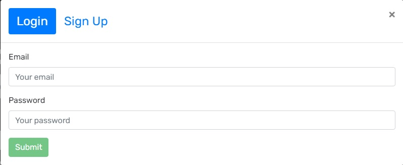
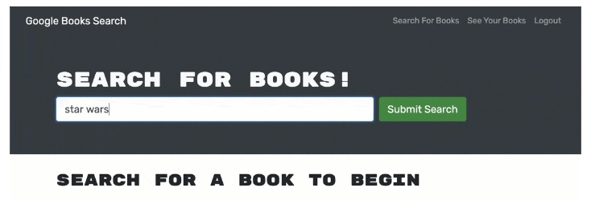
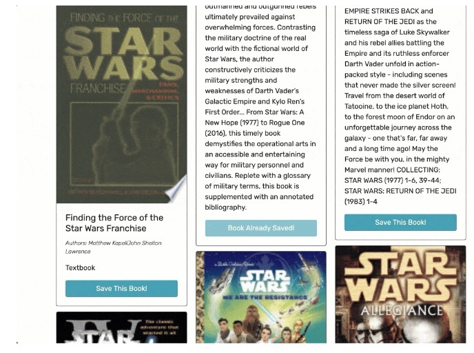
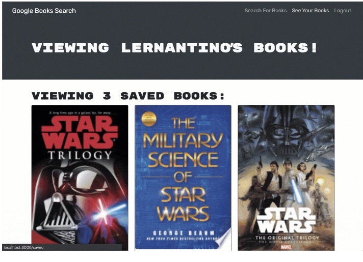
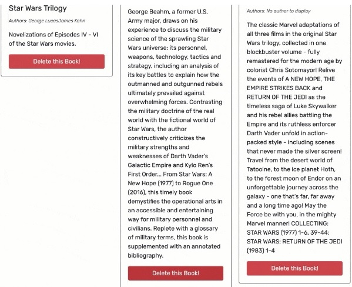

# Book Search Engine
Book Search Engine Project for UNH Boot Camp # 21 - MERN. 
This repository was created for the Homework Assignment dealing with MERN.  

Developer: Duane Cantera 
Date: Feb. 22, 2022 
Assignment: #21 - MERN: Book Search Engine  

This project consisted of taking starter code with a fully functioning Google Books API
search engine built with a RESTful API, and I refactored it to be a GraphQL API built
with Apollo Server.
  

### The application was built using the MERN stack which consists of the following technologies:
 

**M** = MongoDB - Document database. 
**E** = Express - Node.js web framework 
**R** = React.js - Client-Side JavaScript Framework 
**N** - Node.js - The premier JavaScript Web Server.
  

### The following process were performed to complete this assignment.

 

* An Apollo Server was set up to use GraphQL queries and mutations to fetch and modify data,
  replacing the existing RESTFUL API.

* The existing authentication middleware was modified so it works in the context of a GraphQL API.

* An Apollo Provider was created so that requests can communicate with the Apollo Server.

* This web application was deployed to Heroku with a MongoDB database using MongoDB using MongoDB Atlas.
  

### The Application performed the following operations:

 

#### Perform The Login  & Sign Up Operations:
 The user can selet the Login or Sign Up Operations:
 

  

#### Search For A Book:
 The user can type in the search text for a book to search for:
 

  

#### Save A Book:
 The user can select the button "Save This Book".  Once saved button changes to "Book Already Saved":
 

  

#### See Your Books:
 The user can see the books that have been saved:
 

  

#### Delete A Book:
 The user can select the option to delete a book:
 

  

#### Perform The Logout Operation
 The user can select the Logout Link to log off the application:
 

  

## LINKS:

Git Hub Link To Code For Project:  
https://github.com/canterad/Book_Search_Engine.git

 Link to URL of application deployed on Heroku: 
https://guarded-savannah-28899.herokuapp.com/
